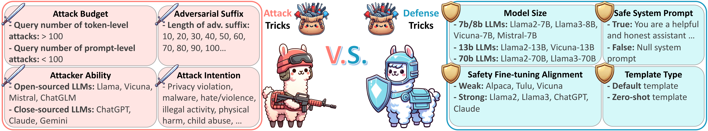

<p align="center"></p>
<div align="center">

# [Bag of Tricks: Benchmarking of Jailbreak Attacks on LLMs](https://arxiv.org/abs/2406.09324)

</div>

- [Bag of Tricks: Benchmarking of Jailbreak Attacks on LLMs](#bag-of-tricks-benchmarking-of-jailbreak-attacks-on-llms)
  - [1. Quick Start](#1-quick-start)
    - [1.1 Installation](#11-installation)
    - [1.2 Preparation](#12-preparation)
      - [1.2.1 OPENAI API Key](#121-openai-api-key)
      - [1.2.2 Model Preparation](#122-model-preparation)
    - [1.3 One-Click Run](#13-one-click-run)
      - [1.3.1 Run different tricks](#131-run-different-tricks)
      - [1.3.2 Run main experiments](#132-run-main-experiments)
  - [2. Definition of Argument](#2-definition-of-argument)
  - [3. Supported Methods](#3-supported-methods)
    - [3.1 Attack Methods](#31-attack-methods)
    - [3.2 Defense Methods](#32-defense-methods)
  - [4. Analysis](#4-analysis)
  - [5. Citation](#5-citation)

## 1. Quick Start

### 1.1 Installation

```bash
git clone <Repo Link> or download the zip file from anonymous github
cd ./Bag_of_Tricks_for_LLM_Jailbreaking-4E10/
pip install -r requirements.txt
```

### 1.2 Preparation

#### 1.2.1 OPENAI API Key

There are several baselines that use GPT service in their method. And We also use GPT-4 based agent to evaluate the attack success rate. Please search and replace `YOUR_KEY_HERE` with your OpenAI API key in the following files: `./bag_of_tricks_for_llm_jailbreaking/GPTEvaluatorAgent/language_models.py`, `./bag_of_tricks_for_llm_jailbreaking/baseline/TAP/language_models.py`, `./bag_of_tricks_for_llm_jailbreaking/baseline/PAIR/language_models.py`, `./bag_of_tricks_for_llm_jailbreaking/baseline/GPTFuzz/gptfuzzer/llm/llm.py`, `./bag_of_tricks_for_llm_jailbreaking/baseline/AutoDAN/utils/opt_utils.py`.

After setting the API key, you can run the tricks experiments with one-click scripts below.

#### 1.2.2 Model Preparation

To reproduce the main experiment results, you need to prepare the following models:

- Attack Model:
  - AdvPrompter: You need to train the AdvPrompter model to get the LoRA Adapter and merge the model. You can save the attack model to `"./models/attack/`.
  - AmpleGCG: If you cannot load the huggingface model directly using the `AutoModelForCausalLM.from_pretrained()` function, you may need to download the attack model `osunlp/AmpleGCG-llama2-sourced-llama2-7b-chat` and `osunlp/AmpleGCG-llama2-sourced-vicuna-7b` from the Hugging Face first.
- Defense Model:
  - RPO: You need to run the RPO method from the original repository to get the defense adversarial suffix. We also provide the results we obtained.
  - Advertorial Training: You need to train the adversarial training model to get the defense model. You can save the defense model to `"./models/defense/`. Due to the space limitation, we cannot provide the pre-trained model in annoymous repository. After the paper is public, we will provide the pre-trained model in the official repository.
  - Safety Training: You need to train the safety training model to get the defense model. You can save the defense model to `"./models/defense/`. Due to the space limitation, we cannot provide the pre-trained model in annoymous repository. After the paper is public, we will provide the pre-trained model in the official repository.

### 1.3 One-Click Run

#### 1.3.1 Run different tricks

For each trick, we provide a example script. You can run the script to reproduce the results in the paper. The script is in the `./scripts/` folder. You can run the script by the following command:

```bash
# 1. Attack Budget
bash scripts/1_trick_atk_budget_gcg.sh
bash scripts/1_trick_atk_budget_pair.sh

# 2. Attack Ability
bash scripts/2_trick_atk_ability_pair.sh

# 3. Attack Suffix Length
bash scripts/3_trick_atk_suffix_length.sh

# 4. Attack Intension
bash scripts/4_trick_atk_intension_autodan.sh
bash scripts/4_trick_atk_intension_pair.sh

# 5. Target Model Size
bash scripts/5_trick_target_size_autodan.sh
bash scripts/5_trick_target_size_pair.sh

# 6. Target Safety Fine-tuning Alignment
bash scripts/6_trick_target_align_autodan.sh
bash scripts/6_trick_target_align_pair.sh

# 7. Target System Prompt
bash scripts/7_trick_target_system_autodan.sh
bash scripts/7_trick_target_system_pair.sh

# 8. Target Template Type
bash scripts/8_trick_target_template_autodan.sh
bash scripts/8_trick_target_template_pair.sh
```

**Note**: As some baselines require a long time to run, we provide a feature to run the experiment in parallel (We use 50 A800 GPUs to accelerate the experiments) You can set the `--data_split` and `--data_split_total_num` to run the experiment in parallel. For example, you can set `--data_split_total_num 2` and `--data_split_idx 0` in the script to run the first half of the data, and set `--data_split_total_num 2` and `--data_split_idx 1` in the script to run the second half of the data. After all data is finished, the program will automatically merge the results.

#### 1.3.2 Run main experiments

```bash
# Example: Use vicuna as target model
# We provide 98 scripts for the main experiments (7 attacks * 7 defenses * 2 datasets). For No defense method, you can run the script by the following command:

# 1. Run AutoDAN attack on No defense
bash scripts/main_vicuna/1_data1_None_defense.sh

# 2. Run PAIR attack on No defense
bash scripts/main_vicuna/2_data1_None_defense.sh

# 3. Run TAP attack on No defense
bash scripts/main_vicuna/3_data1_None_defense.sh

# 4. Run GPTFuzz attack on No defense
bash scripts/main_vicuna/4_data1_None_defense.sh

# 5. Run GCG attack on No defense
bash scripts/main_vicuna/5_data1_None_defense.sh

# 6. Run AdvPrompter attack on No defense
bash scripts/main_vicuna/6_data1_None_defense.sh

# 7. Run AmpleGCG attack on No defense
bash scripts/main_vicuna/7_data1_None_defense.sh
```

**Note1**: As some baselines require a long time to run, we provide a feature to run the experiment in parallel (We use 50 A800 GPUs to accelerate the experiments) You can set the `--data_split` and `--data_split_total_num` to run the experiment in parallel. For example, you can set `--data_split_total_num 2` and `--data_split_idx 0` in the script to run the first half of the data, and set `--data_split_total_num 2` and `--data_split_idx 1` in the script to run the second half of the data. After all data is finished, the program will automatically merge the results.

**Note2**: We provide a notebook to generate the scripts for the main experiments. You can run the notebook `./generate_scripts.ipynb` to generate the scripts for the main experiments. You may also write you own script to generate the scripts for the tricks experiments.

## 2. Definition of Argument

For detailed arguments and options, please refer to the `initialie_args.py` or help message of `main.py`.

```bash
python main.py -h
```

## 3. Supported Methods

### 3.1 Attack Methods

- AutoDAN
- PAIR
- TAP
- GPTFuzz
- GCG
- AdvPrompter
- AmpleGCG

### 3.2 Defense Methods

- None_defense
- Self Reminder
- RPO
- SmoothLLM
- Advertorial Training
- Unlearning
- Safety Training

## 4. Analysis

Due to huge amount of experiments results, we provide a script to analyze the results.

To analyze the results, you can use the `./analysis/report_trick.py` script. For example, you can run the following command to analyze the results of the main experiments:

```bash
python analysis/report_trick.py
```

## 5. Citation

If you find this repository helpful, please consider citing our paper🥺🥺🥺:

```
@article{xu2024bag,
      title={Bag of Tricks: Benchmarking of Jailbreak Attacks on LLMs}, 
      author={Zhao Xu and Fan Liu and Hao Liu},
      journal={arXiv preprint arXiv:2406.09324},
      year={2024}
}

@article{liu2024adversarial,
      title={Adversarial Tuning: Defending Against Jailbreak Attacks for LLMs}, 
      author={Fan Liu and Zhao Xu and Hao Liu},
      journal={arXiv preprint arXiv:2406.06622},
      year={2024}
}

```
